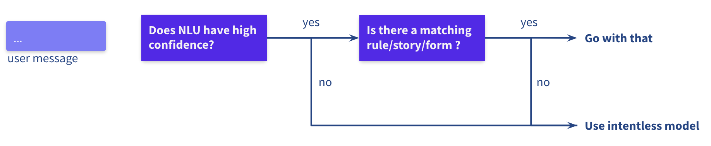

# Intentless Policy

The new intentless policy leverages large language models (LLMs) to 
complement existing rasa components and make it easier:

- to build assistants without needing to define a lot of intent example
- to incorporate unstructured data such as FAQs or existing conversations logs
- to handle conversations where messages [don't fit intents](https://rasa.com/blog/were-a-step-closer-to-getting-rid-of-intents/) and conversation context is necessary to choose a course of action. 

To provide the appropriate guard rails and steering for the LLM you can
- whitelist utterances to specify allowed responses for the LLM
- provide example conversations to give information about your domain and teach the LLM what to say when
- set thresholds to determine when the intentless policy should take over from the traditional NLU and core components

This repository contains a starter pack with a bot that uses the
`IntentlessPolicy`. It's a good starting point for trying out
the policy and for extending it.

## Beta State Notice 🚨

The `IntentlessPolicy` is a Rasa Pro **beta feature**. The current version of
the policy is a prototype that we're releasing to gather feedback. Its use
should be limited to development and experimentation. We are iterating on the
model regularly, so expect model predictions to also change for the duration of the beta.

The beta allows you to try out the concept and to anticipate and influence
our further developments of this feature.

## Demo

[Webinar demo](https://hubs.ly/Q01CLhyG0) showing that this policy can already handle
some advanced linguistic phenomena out of the box.

The examples in the webinar recording are also part of the end-to-end
tests defined in this repo (`tests/e2e_test_stories.yml`).

## Installing the Intentless Policy

The starter pack in this repository is ready to go after a few short steps:
* Install the dependencies using `poetry install`
* set your Rasa Pro license as an environment variable `export RASA_PRO_LICENSE="eyJhbGciOiJSU..."`
* set the feature flag for the beta `export RASA_PRO_BETA_INTENTLESS=true`
* activate the poetry environment with `poetry shell` and skip the rest of this section

### Installing the beta in your own project

To use the beta in your own project, you'll need to install the `rasa-plus` package
which is a drop-in replacement for the `rasa` package for Rasa Pro license holders. 
To access this package you need  to first add our custom Rasa Plus repository 
for installation with 
[pip](https://rasa.com/docs/rasa/installation/rasa-pro/installation/#installing-with-pip)
or [poetry](https://rasa.com/docs/rasa/installation/rasa-pro/installation/#installing-with-poetry) 
depending on your project setup.

Once you have added our custom Rasa Plus repository you can add the `rasa-plus` package.
The version you need for the intentless policy is `3.5.0.b2`.

- using pip: `pip install rasa-plus==3.5.0b2`
- using poetry: `poetry add rasa-plus==3.5.0b2`

Finally, make sure your Rasa Pro License key is available as an environment variable:

```bash
export RASA_PRO_LICENSE="eyJhbGciOiJSU..."
```

and to also set the intentless beta feature flag:

```bash
export RASA_PRO_BETA_INTENTLESS=true
```

Now you are ready to configure, run and adjust the policy!

## Configuring the Intentless Policy

The `IntentlessPolicy` can be configured with the following parameters:

- `max_history`: The maximum number of turns to take into account
  when predicting the next action. Defaults to `null`, which means that all
  conversation history is taken into account.
- `nlu_abstention_threshold`: The threshold for the NLU prediction confidence.
  Defaults to `0.9`. The intentless policy kicks in below this threshold.

The following example shows the default configuration in the `config.yml`:

```yaml
policies:
  # ... any other policies you have
  - name: rasa_plus.ml.IntentlessPolicy
    max_history: null
    nlu_abstention_threshold: 0.9
```

## Configuring other policies to work together with the Intentless Policy

For any rule-based policies in your pipeline, set `use_nlu_confidence_as_score: True`. 
Otherwise, the rule-based policies will always make predictions
with confidence value 1.0, ignoring any uncertainty from the NLU prediction:

```yaml
policies:
- name: MemoizationPolicy
  max_history: 5
  use_nlu_confidence_as_score: True
- name: RulePolicy
  use_nlu_confidence_as_score: True
- name: rasa_plus.ml.IntentlessPolicy
```

This is important because the intentless policy kicks in only if the other policies are 
uncertain:

- If there is a high-confidence NLU prediction and a matching story/rule,
  the `RulePolicy` or `MemoizationPolicy` will be used.

- If there is a high-confidence NLU prediction but no matching story/ rule,
  the `IntentlessPolicy` will kick in.

- If the NLU prediction has low confidence, the `IntentlessPolicy` will kick in.

- If the `IntentlessPolicy` prediction has low confidence,
  the `RulePolicy` will trigger fallback based on the `core_fallback_threshold`.



**What about TED?**

There is no reason why you can’t also have TED in your configuration. However,

- TED frequently makes predictions with very high confidence values (~0.99)
  so will often override what the `IntentlessPolicy` is doing.
- TED and the `IntentlessPolicy` are trying to solve similar problems, so your system
  is easier to reason about if you just use one or the other.

## Steering the Intentless Policy

The first step to steering the intentless policy is adding and editing responses in the
domain file. Any response in the domain file can be chosen as an response by 
the intentless policy. This whitelisting ensures that your assistant can never utter any
inappropriate responses.

```yaml
  utter_faq_4:
  - text: We currently offer 24 currencies, including USD, EUR, GBP, JPY, CAD, AUD,
      and more!
  utter_faq_5:
  - text: Absolutely! We offer a feature that allows you to set up automatic transfers
      to your account while you're away. Would you like to learn more about this feature?
  utter_faq_6:
  - text: You can contact our customer service team to have your PIN unblocked. You
      can reach them by calling our toll-free number at 1-800-555-1234.
```
Beyond having the `utter_` prefix, the naming of the utterances is not relevant.


The second step is to add 
[end-to-end stories](https://rasa.com/docs/rasa/training-data-format/#end-to-end-training)
to `data/e2e_stories.yml`.
These stories teach the LLM about your domain it can start judging when to say what.

```yaml
- story: currencies
  steps:
  - user: How many different currencies can I hold money in?
  - action: utter_faq_4

- story: automatic transfers travel
  steps:
  - user: Can I add money automatically to my account while traveling?
  - action: utter_faq_5

- story: user gives a reason why they can't visit the branch
  steps:
  - user: I'd like to add my wife to my credit card
  - action: utter_faq_10
  - user: I've got a broken leg
  - action: utter_faq_11
```

The stories and utterances in combination are used to steer the LLM. The difference 
here to the existing policies is, that you don't need to add a lot of intent examples 
to get this system going.


## Training the Intentless Policy

With the intentless policy you can train your assistant just as before using

```bash
rasa train
```

Keep in mind that the intentless policy beta is using a web service hosted by rasa to 
train the policy and to make inferences. Thus, you will need an active internet 
connection during training and inference time.

During training, responses from the domain file and e2e training stories 
are sent to the rasa web service and stored on rasa servers. The training returns a 
randomly-generated model ID which is then stored locally in your policy cache 
inside the `.rasa` directory. This model ID is later used during inference when the 
policy is triggered.

> Models from different rasa customers are stored separately, so every customer can 
> access only to its organisation’s models (which is based on rasa pro license key)


## Testing the Intentless Policy

Once trained, you can test your assistant interactively by running the following command:

```bash
rasa shell
```

If a flow you'd like to implement doesn't already work out of the box, you
can add try to change the examples for the intentless policy. Don't forget that you can
also add and edit the traditional Rasa primitives like intents, entities, slots, 
rules, etc. as you normally would. The `IntentlessPolicy` will kick in only when the 
traditional primitives have low confidence.

### Testing with End-to-End stories

As part of the beta, we're also releasing a beta version of
a new End-To-End testing framework. The `rasa test e2e` command allows you to
test your bot end-to-end, i.e. from the user's perspective. You can use it to
test your bot in a variety of ways, including testing the `IntentlessPolicy`.

To use the new testing framework, you need to define a set of test cases in
a test folder, e.g. `tests/e2e_test_stories.yml`. The test cases are defined
in a similar format as stories are, but contain the user's messages and the
bot's responses. Here's an example:

```yaml
test_cases:
  - test_case: transfer charge
    steps:
      - user: how can I send money without getting charged?
      - utter: utter_faq_0
      - user: not zelle. a normal transfer
      - utter: utter_faq_7
```

**Please ensure all your test stories have unique names!**
After setting the beta feature flag for E2E testing in your current shell with
`export RASA_PRO_BETA_E2E=true`, you can run the tests 
with `rasa test e2e -f tests/e2e_test_stories.yml` 

### Generating End-to-End stories from existing training data

In this starter pack we provide a script that combines existing NLU data and stories
to create end-to-end stories. You can use this script to compare different 
configurations and combinations of policies. For example, you can split your 
existing data, create more test cases and compare the performance with and without the
intentless policy:

First, split your NLU data into train and test sets:

```bash
rasa data split nlu -u data/nlu.yml --training-fraction 0.5
```

Then run End-to-End test creation script from this starter pack. This script combines 
your NLU test data with your bot's stories:

```bash
python scripts/create_test_cases.py -u train_test_split/test_data.yml -s 'data/core/*yml'
```

Replacing the `-s` argument with the path to your stories file or a glob to match multiple filenames.

Inspect the `generated_test_cases.yml` to check these that test cases make sense.

Re-train your model- ensuring you only use the **training** data from your split for NLU training.

Run your test cases:

```bash
rasa test e2e -f generated_test_cases.yml
```

You can then try different policies, parameters, etc. in your `config.yml` to compare test performance.


## FAQ

### How does the Intentless Policy work as a remote service?

The new `rasa_plus.ml.IntentlessPolicy` is different from existing 
[Rasa policies](https://rasa.com/docs/rasa/policies), such as 
`MemoizationPolicy` or `TEDPolicy` in being implemented as a remote service rather
than a local machine learning model. 

To this end, the policy requires a connection to the rasa-hosted 
service at [`ml.rasa-dev.io`](http://ml.rasa-dev.io/). The training is performed on the 
service side and every time a new model is trained, a model ID is generated and stored 
in your local policy cache (which is inside `.rasa` directory of your project). 
Inference, i.e. prediction of bot’s responses on user’s prompt, is also performed 
by the service. To do that, the model ID and conversation tracker are sent to the 
rasa web service.

### How is data handled?

The policy makes use of an intentless dialogue model which is implemented as a hosted service.

We log requests made to this server so that we can improve the model over time.

### What about entities?

Entities are currently not handled by the intentless policy. They have to still be dealt 
with using the traditional NLU approaches and slots.

### What about custom actions?

At this point, the intentless policy can only predict utterances but not custom actions.
Triggering custom actions needs to be done by traditional policies, such as the rule-
or memoization policy.

## We want to hear from you

At Rasa we’re keen to improve our products and hear from users’ experience. We’d love to hear from you, especially:

- How many use cases did you implement?
- How many intents did you define?
- How many stories did you write?
- How was the success rate of your test stories impacted by the `IntentlessPolicy`?

## Disclaimer

This software release, including the Intentless Policy feature, is beta software.
It’s provided to you only for trial and evaluation, “as is”. You cannot use this beta software release
as part of any production environment. Beta software releases are not intended for processing sensitive
or personal data. There may be bugs or errors. We may never commercialize some beta software.
We disclaim all liabilities, warranties, representations, or covenants related to this beta release.

Your use of the Intentless Policy feature and any other software or material included in this release
is subject to the [Beta Software Terms](https://rasa.com/beta-terms/).

Please make sure you read these terms and conditions prior to using this beta release.
